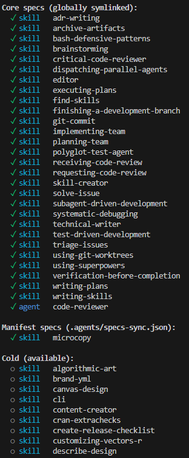

## Skills are to LLMs what packages are to programming languages

The more I use CLI LLM tools like Claude Code and Opencode, the more I realise that :
- the skills specification is one of the best ideas I've seen and used until now
- it does exactly what packages do with my favourite languages : factorise some cool stuff into reusable chunks that I can call with very few words
- it's still not mature and it should definitely evolve to behave like packages

I've been experimenting with ideas that revolve around this skills as packages approximation and I like the current results enough that I want to talk about it, if only to read it back again in a few months and see how bad this take is. My current take on this is an agent kit manager (akm)

## Skills are such a good idea

LLM Skills, as in the [open specification](https://agentskills.io/home) for a reusable prompt format, are CLEVER.
Everyone was playing around with prompt engineering and reusing bits that worked in larger and larger prompts, copy and pasting things, cross referencing structural documents. Skills deliver on all fronts : progressive disclosure lets us save some context for the good stuff before landing in the [dumb zone](https://www.youtube.com/watch?v=rmvDxxNubIg), self-activation means we don't have to waste turns or tokens naming the invocation, and the folder structure means we can have even more progressive disclosure, with files read only in certain situations, scripts used as part of the skill ...

Right after codifying actions, skills are the best option for reproducibility of good output (or at least, the output you expect from a task).

I daily drive 2 tools : Claude Code and Copilot CLI, and I try to replicate everything I learn into Mistral Vibe and OpenCode too. They all support skills. So do at least 30 others like Cursor, Kimi Code CLI, Antigravity, Cline, Codex, Gemini CLI and all the others that I can't name but know exist.
If that's not a consensus, I don't know what is.

To this date, I've tried probably around 100 skills. I'd say around 80 found online and 10 to 20 tailor built for a repo / situation. They help push the agent towards working methodologies like lean, tdd, how to write ADRs, how to review code, how to use a specific R or JS package ... They work !

## Skill management needs to mature

The first thing that bothered me happened because I'm a hoarder : I was downloading skills left and right, and asking Opus to make a lot of them from books/blogs and package documentation of my favourite packages, "to have them just in case".
Suddenly, I land on a [skill aggregator](https://skillsmp.com/) which states that it's found 200k+ skills !
Even with progressive disclosure, at a stupidly impossible 1 tok/skill that's still more tokens than Opus' context window, twice its "smart window" !
Even though I was FAR from flooding the LLM's context with my < 100 skills, it now felt like I was doing something unsustainable.

Another issue that arose even more quickly : staleness.
Between [superpowers](https://github.com/obra/superpowers)[^1] that kept growing, but only updated automatically in Claude Code (thanks to the marketplace installation), my own skills evolving each session, my repos quickly ended up having different versions of the same skills, and I couldn't track what was where or what was working/not.

[^1]: If you don't know about that one you're missing something crucial. The brainstorming skill is probably the single most value-adding skill I've used yet

In addition, all these skills had to be copy pasted in the appropriate places : .claude, .github, wait no that's .agents, wait I want it globally, wait no it's creating confusion in that repo, WAIT this machine has none of my global skills !!
The frustration of manually managing all of this really triggered my nerd reflex of trying to [automate the thing](https://xkcd.com/1319/).

Last, but not least maybe, I have conflicting feelings about repo-local skills. I can make the case for skills being in the repo, to let others know how you've used LLMs to generate code or documentation. But I also find it quite annoying how different and noisy it is to the rest of the codebase. I don't think I need to have the full spec committed to 4 different folders in my repo just because I test drive 4 CLI tools. I should be able to declare the skills I use in a compact and standardized format.

## Wait : isn't this just what package managers are for ?

Skills are packages for LLMs, and I feel like we need to push the same standards. Every popular open source language has packages and a package manager. Bits of symbols someone has bundled together that make the program do a cool action and you get to call it with one or few symbols. Factorise the behaviour. We describe package dependencies in manifest files, rely on versioning, and one or multiple registries to hold the latest versions. That's a core part of centralising open source efforts, enforcing documentation standards, and in return gain more reproducibility, distribution, install / update commands. Python has PyPi, Node has npm, R has CRAN, Rust has Cargo ... Obviously the analogy collapses because skills are not actual code, but it's more than enough to warrant a similar treatment.

It's a weird feeling for me to try and build something that, to my current knowledge, nobody had already built and open-sourced yet it feels like I can't be the only one thinking. Is it the way LLM coding seems to atomise everything instead of bringing ideas together ? Is everyone developing the cool things in their basement ? Is everyone afraid of getting their ideas stolen now that the cost of writing code is in full deflation ? I really don't know, but I don't fit in these categories and I have my own goal of writing more : so here I am !

Anyway, the only thing I found when I started tinkering with automated skill management around mid-january (repo says 13/01 for first commit) was ... nothing. I mean, the marketplace thing in Claude Code was nice, but I mean open-source and tool-agnostic solution. About 2 weeks ago I finally noticed (thanks to SkillsMP) that [npx skills](https://www.npmjs.com/package/skills?activeTab=readme) existed, and this one is really cool ! It solved quite a few of the issues I was having, especially distribution across many CLI tools (they support ~40 !!!), updating and tracking from source, global/local management.

But there was still the issue of growing collection of skills, and repo-pollution.

## My take : `akm`, the agent kit manager

What is [akm](https://github.com/akm-rs/akm) ? a CLI-tool, currently really just a patchwork of bash scripts and dreams.

It glues together :
- A cold storage for skills
- A distribution system across LLM cli-tools 
- A management system for skills scope 
- A skill promotion system
- An artifacts (plans etc) centralisation system, outside the repo but in scope for the LLM (again, it's really just add-dir and a wrapper around the CLI tool entrypoint)
- An instructions centralisation manager : edit once, distribute across tools and repos

So, first things first : the novel thing I built for myself is a cold-storage for skills.
It's quite simple : skills are stored in .local/share/llm-skills in each machine, single copy, CLI-tool invisible.

I then generate a library.json file from the assortment of folders, and I can add variables to each skill : is it destined to the global folder (core: true) ? What are its tags (for search) ?
Then it's all bash scripts and 3 layers of skill activation :

### Layer 1

Another script symlinks the core skills to the global skills directories for my 4 tools

My growing collection is managed in a git repo, and I use it as the central source of truth across machines (library.json included), so that on each machine I only need to run a "sync" bash script to update from the remote and rebuild the symlinks.

### Layer 2

At the repo level, I'm quite proud of the current iteration :

I have a wrapper around the entrypoint each CLI tool (claude() etc) that creates a temporary directory and passes it to the `--add-dir` argument, then reads a manifest file in the repo that declares the skills to activate in that repo and symlinks them to the temp-dir. When I exit the session, the temp-dir is deleted. I can add/remove skills to the repo's manifest using a cli command, which edits the manifest in .agents/ and that's it. I like this, it maps to my mental model of adding packages to DESCRIPTION in R, or requirements.txt or cargo.toml or package.json.

### Layer 3

And then there's this thing I am very attached to, but I can't really justify it as well as the rest. akm has `load` and `unload`.
What they do is hotload a skill in the temp dir, *without* adding it to the manifest. 

What am I trying to achieve with this ? 

First, I want agents in separate sessions to be able to use skills needed only for their session, without modifying the repo's manifest. A specific task needs a very niche skill ? 
My ultimate goal there is to see if I can somehow have "just in time" (JIT) skills, maybe even *build* one inside a nested team of agents that elaborate it in iterative tasks ? 
It's clearly the most "finger-waving" thing right now, I'll need to use it for a while and see what happens. 

Here are some examples of `akm status` and `akm add/remove` :

 

## The artifacts manager

The last thing I want to mention is the artifacts manager. It's really just a directory that is added to the context of the LLM, and where I can store things like plans, notes, ADRs, or whatever I want to keep track of across sessions but don't want to commit to the repo. It's really just a `--add-dir ~/.akm/artifacts/<repo>/` automatically added when starting a session, with auto commit / push / pull for cross-machine sync. It has been quite useful already, and that's actually this perk that led me to transform my initial project that also had gitconfig and other personal files into akm : a friend asked to use my artifacts trick and that gave me the confidence to open source the whole thing :-) 

## The instructions manager

Even more simple : akm creates global-instructions.md in ~/.akm/ and symlinks it to the global instructions of each CLI tool. This way I can edit it once and have it distributed across all tools. I even added last minute a config command to mimic git config --edit. 

## Things I need to figure out

I really enjoy what I'm doing here, I love this new workflow with skills. But there are many things I'm missing right now :

- A proper registry : instead of a private personal repo, I'd prefer relying on a proper registry with snapshots and all the goodies, and a way to publish to it.
- Versioning : if skills are packages, then I'd like to figure out skills versions semantics. That would enable to declare / pull exact dependencies for each project from the manifest.
- Dependencies : if skills rely on other skills, I'd like to figure out how to track skills dependencies 
- Discovery and distribution : the current flow is based on a repo, I'd like to learn how to setup a proper registry to push/pull to/from
- How to fight against poisoning : supply-chain attacks made a few headlines this past year, and skills are so vulnerable to it, as well as their speed-addicted users like me who will often trade review for another turn in the session ... 
- A CLI UI for skill search / metadata / management

## From me to future-me

Future me, if you haven't deleted this site out of shame for what you wrote, I hope that skills-as-packages is evident by now, and if you've dropped the skill kit for some really cool open source skill manager made by awesome people, I forgive you.
