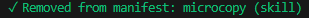

::: {.callout-note}
Cet article a été traduit de [la version anglaise](/en/blog/posts/cold-skills/) par un LLM, avec relecture humaine.
:::

## Les skills sont aux LLM ce que les packages sont aux langages de programmation

Plus j'utilise des outils LLM en CLI comme Claude Code et Opencode, plus je réalise que :

- le principe des skills est l'une des meilleures idées que j'ai vues et utilisées jusqu'ici dans l'exercice de travailler avec des LLMs
- ça fait exactement ce que les packages font avec mes langages préférés : factoriser des trucs complexes et utiles en briques réutilisables qu'on peut appeler en quelques mots
- c'est encore immature et ça devrait clairement évoluer pour se comporter comme des packages

Je bidouille autour de cette approximation skills~=packages et les résultats actuels me plaisent assez pour en parler, ne serait-ce que pour me relire dans quelques mois et constater à quel point cette prise de position vieillit mal. De cette vision découle mon approche actuelle : Agent Kit Manager (akm).

## Les skills, une super idée

Les LLM Skills, au sens de la [spécification ouverte](https://agentskills.io/home) pour un format de prompt réutilisable, c'est MALIN.
Tout le monde bidouillait du prompt engineering et réutilisait des bouts qui marchaient dans des prompts de plus en plus longs, à coups de copier-coller et de renvois vers des documents longs comme le bras. Les skills répondent à tout : le progressive disclosure permet de garder du contexte pour l'essentiel avant d'atterrir dans la [dumb zone](https://www.youtube.com/watch?v=rmvDxxNubIg), l'auto-activation fait qu'on ne gaspille ni tours ni tokens à invoquer explicitement le skill, et l'arborescence de dossiers permet d'aller encore plus loin dans le progressive disclosure, avec des fichiers lus uniquement dans certaines situations, des scripts utilisés par le skill...

Juste après la formalisation des actions, les skills sont la meilleure option pour la reproductibilité d'un bon output (ou du moins, de l'output qu'on attend d'une tâche).

Au quotidien j'utilise 2 outils : Claude Code et Copilot CLI, et j'essaie de reproduire tout ce que j'apprends dans Mistral Vibe et OpenCode aussi. Ils supportent tous les skills. Au moins 30 autres aussi : Cursor, Kimi Code CLI, Antigravity, Cline, Codex, Gemini CLI et tous les autres que je ne peux pas nommer mais qui existent.
Si ça c'est pas un consensus, je ne sais pas ce que c'est.

À ce jour, j'ai probablement essayé une centaine de skills. Je dirais environ 80 trouvés en ligne et 10 à 20 construits sur mesure pour un repo ou une situation. Ils orientent l'agent vers des méthodologies de travail comme le lean, le TDD, comment écrire des ADRs, comment faire de la code review, comment utiliser un package R ou JS spécifique... Ça marche !

## La gestion des skills doit mûrir

Le premier truc qui m'a gêné, ça vient du fait que je suis un accumulateur : je téléchargeais des skills à tout va, et je demandais à Opus d'en fabriquer plein à partir de livres/blogs et de la documentation de mes packages préférés, "au cas où".
Et puis je tombe sur un [agrégateur de skills](https://skillsmp.com/) qui annonce avoir trouvé plus de 200 000 skills !
Même avec le progressive disclosure, à un ratio ridiculement impossible d'1 token/skill, ça fait toujours plus de tokens que la context window d'Opus, le double de sa "smart window" !
Même si j'étais LOIN d'inonder le contexte du LLM avec mes < 100 skills, j'avais maintenant l'impression de faire un truc pas tenable.

Un autre problème est apparu encore plus vite : l'obsolescence.
Entre [superpowers](https://github.com/obra/superpowers)[^1] qui grossissait sans cesse, mais ne se mettait à jour automatiquement que dans Claude Code (grâce à l'installation via le marketplace), mes propres skills qui évoluaient à chaque session, mes repos se sont vite retrouvés avec des versions différentes des mêmes skills, et je ne pouvais plus suivre ce qui était où ni ce qui marchait ou pas.

[^1]: Si vous ne connaissez pas celui-là, il vous manque quelque chose de crucial. Le skill de brainstorming est probablement le skill qui m'a apporté le plus de valeur jusqu'ici.

En plus, tous ces skills devaient être copiés-collés aux bons endroits : .claude, .github, ah non c'est .agents, attends je le veux en global, ah non ça crée de la confusion dans ce repo, ATTENDS cette machine n'a aucun de mes skills globaux !!
La frustration de gérer tout ça à la main a vraiment déclenché mon réflexe de nerd d'essayer d'[automatiser le truc](https://xkcd.com/1319/).

Dernier point, et peut-être pas le moindre : j'ai des sentiments contradictoires sur les skills au niveau du repo. Je comprends l'intérêt d'avoir les skills dans le repo, pour montrer aux autres comment on a utilisé les LLM pour générer du code ou de la documentation. Mais je trouve aussi assez pénible à quel point c'est différent et bruyant par rapport au reste du codebase. Je n'ai pas besoin d'avoir la spec complète commitée dans 4 dossiers différents de mon repo juste parce que je teste 4 outils CLI. Je devrais pouvoir déclarer les skills que j'utilise dans un format compact et standardisé.

## Attendez : c'est pas exactement le rôle des gestionnaires de packages ?

Les skills sont des packages pour LLM, et je pense qu'il faut appliquer les mêmes standards. Tous les langages open source populaires ont des packages et un gestionnaire de packages. Des bouts de code que quelqu'un a empaquetés pour que le programme fasse un truc cool, et qu'on invoque en quelques mots. Factoriser le comportement. On décrit les dépendances dans des fichiers manifeste, on s'appuie sur le versioning, et un ou plusieurs registres pour héberger les dernières versions. C'est le cœur de l'open source : centraliser les efforts, imposer des standards de documentation, et en retour gagner en reproductibilité, en distribution, en commandes d'install / update. Python a PyPi, Node a npm, R a CRAN, Rust a Cargo... Évidemment l'analogie s'effondre parce que les skills ne sont pas du vrai code, mais c'est largement suffisant pour justifier un traitement similaire.

Ça fait bizarre de construire un truc que, à ma connaissance, personne n'avait encore construit et open-sourcé, alors que je peux pas être le seul à y penser. C'est parce que le coding par LLM atomise tout au lieu de rassembler les idées ? Est-ce que tout le monde développe les trucs cool dans sa cave ? Est-ce que tout le monde a peur de se faire piquer ses idées maintenant que le coût d'écriture du code est en pleine déflation ? Franchement aucune idée, mais je ne rentre dans aucune de ces catégories et j'ai mon propre objectif d'écrire plus : alors me voilà !

Bref, le seul truc que j'ai trouvé quand j'ai commencé à bidouiller la gestion automatisée des skills vers mi-janvier (le repo dit 13/01 pour le premier commit) c'était... rien. Le système de marketplace dans Claude Code était sympa, mais je parle d'une solution open-source et agnostique. Il y a environ 2 semaines j'ai enfin remarqué (grâce à SkillsMP) que [npx skills](https://www.npmjs.com/package/skills?activeTab=readme) existait, et celui-là est vraiment cool ! Il résolvait pas mal de mes problèmes, surtout la distribution sur de nombreux outils CLI (ils en supportent ~40 !!!), la mise à jour et le suivi depuis la source, la gestion globale/locale.

Mais il restait le problème de la collection grandissante de skills, et de la pollution du repo.

## Ma vision : `akm`, l'agent kit manager

C'est quoi [akm](https://github.com/akm-rs/akm) ? Un outil CLI, pour l'instant vraiment juste un patchwork de scripts bash et de rêves.

Il assemble :
- Un stockage à froid pour les skills
- Un système de distribution vers les outils CLI LLM
- Un système de gestion du scope des skills
- Un système de promotion de skills
- Un système de centralisation des artifacts (plans etc), hors du repo mais dans le scope du LLM (encore une fois, c'est vraiment juste un add-dir et un wrapper autour du point d'entrée de l'outil CLI)
- Un gestionnaire centralisé d'instructions : éditer une fois, distribuer sur tous les outils et repos

Donc, commençons par le commencement : la nouveauté que j'ai construite pour moi-même, c'est un stockage à froid pour les skills.
C'est assez simple : les skills sont rangés dans .local/share/llm-skills sur chaque machine, copie unique, invisibles pour les outils CLI.

Je génère ensuite un fichier library.json à partir de l'ensemble des dossiers, et je peux ajouter des variables à chaque skill : est-il destiné au dossier global (core: true) ? Quels sont ses tags (pour la recherche) ?
Ensuite c'est que des scripts bash et 3 couches d'activation des skills :

### Couche 1

Un autre script crée des symlinks des skills core vers les dossiers de skills globaux de mes 4 outils.

Ma collection grandissante est gérée dans un repo git, que j'utilise comme source de vérité centrale entre machines (library.json inclus), de sorte que sur chaque machine il me suffit de lancer un script bash "sync" pour mettre à jour depuis le remote et reconstruire les symlinks.

### Couche 2

Au niveau du repo, je suis assez fier de l'itération actuelle :

J'ai un wrapper autour du point d'entrée de chaque outil CLI (claude() etc) qui crée un répertoire temporaire et le passe à l'argument `--add-dir`, puis lit un fichier manifeste dans le repo qui déclare les skills à activer dans ce repo et les symlinke vers le répertoire temporaire. Quand je quitte la session, le répertoire temporaire est supprimé. Je peux ajouter/retirer des skills au manifeste du repo via une commande CLI, qui modifie le manifeste dans .agents/ et c'est tout. J'aime bien ça, ça correspond à mon modèle mental d'ajouter des packages au DESCRIPTION en R, ou requirements.txt ou cargo.toml ou package.json.

### Couche 3

Et puis il y a ce truc auquel je tiens beaucoup, mais que je ne peux pas justifier aussi bien que le reste. akm a `load` et `unload`.
Ce que ça fait : charger à chaud un skill dans le répertoire temporaire, *sans* l'ajouter au manifeste.

Qu'est-ce que j'essaie d'accomplir avec ça ?

D'abord, je veux que des agents dans des sessions séparées puissent utiliser des skills nécessaires uniquement pour leur session, sans modifier le manifeste du repo. Une tâche spécifique a besoin d'un skill très niche ?
Mon graal, c'est d'arriver à des skills "juste à temps" (JIT), peut-être même en *construire* un à la volée avec une équipe d'agents imbriqués qui itèrent dessus.
C'est clairement la partie la plus spéculative pour l'instant, il faudra que je l'utilise un moment pour voir ce que ça donne.

Voici quelques exemples d'`akm status` et `akm add/remove` :

## Le gestionnaire d'artifacts

Dernier truc dont je veux parler : le gestionnaire d'artifacts. C'est vraiment juste un répertoire ajouté au contexte du LLM, où je peux stocker des trucs comme des plans, des notes, des ADRs, ou tout ce que je veux garder entre les sessions mais que je ne veux pas commiter dans le repo. C'est vraiment juste un `--add-dir ~/.akm/artifacts/<repo>/` ajouté automatiquement au lancement d'une session, avec auto commit / push / pull pour la synchronisation entre machines. C'est déjà bien utile, et c'est d'ailleurs ça qui m'a poussé à transformer mon projet initial (qui contenait aussi gitconfig et d'autres fichiers perso) en akm : un ami a voulu utiliser mon astuce d'artifacts et ça m'a donné la confiance d'open-sourcer le tout :-)

## Le gestionnaire d'instructions

Encore plus simple : akm crée global-instructions.md dans ~/.akm/ et le symlinke vers les instructions globales de chaque outil CLI. Comme ça je peux éditer une seule fois et distribuer à tous les outils. J'ai même ajouté en dernière minute une commande config pour imiter git config --edit.

## Ce qu'il me reste à résoudre

Je prends vraiment plaisir à ce que je fais ici, j'adore ce nouveau workflow avec les skills. Mais il me manque encore beaucoup de choses :

- Un vrai registre : au lieu d'un repo personnel privé, je préférerais m'appuyer sur un registre en bonne et due forme avec des snapshots et tout le tralala, et un moyen d'y publier.
- Le versioning : si les skills sont des packages, j'aimerais définir une sémantique de version pour les skills. Ça permettrait de déclarer / récupérer des dépendances exactes pour chaque projet depuis le manifeste.
- Les dépendances : si des skills reposent sur d'autres skills, j'aimerais trouver comment suivre les dépendances entre skills.
- La découverte et la distribution : le flux actuel repose sur un repo, j'aimerais apprendre à mettre en place un vrai registre pour push/pull.
- Comment lutter contre l'empoisonnement : les attaques supply-chain ont fait parler d'elles cette année, et les skills y sont très vulnérables, tout comme leurs utilisateurs accros à la vitesse comme moi qui sacrifient la relecture pour un tour de plus dans la session...
- Une interface CLI pour la recherche / les métadonnées / la gestion des skills.

## De moi à mon moi du futur

Moi du futur, si tu n'as pas supprimé ce site par honte de ce que tu as écrit, j'espère que le concept de skills-comme-packages est devenu une évidence, et si tu as laissé tomber le skill kit pour un super gestionnaire de skills open source fait par des gens formidables, je te pardonne.
